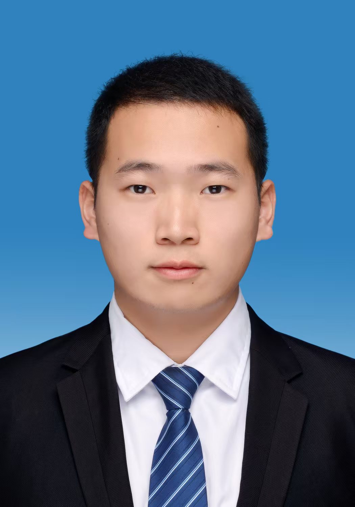

# 陈蓉杰 | Rongjie Chen

  
  
  
  **隐私保护 | 深度学习 | 机器学习安全**
  
  **福建师范大学 研究生**
  
  [📧 邮箱](mailto:chenr5425@gmail.com) • [🔗 LinkedIn](https://linkedin.com/in/rongjie-chen) • [📄 个人网站](#)

---

## 👋 关于我

你好！我是陈蓉杰（Rongjie Chen），一位对隐私保护和深度学习充满热情的研究者。我目前是福建师范大学的研究生，致力于研究如何在保护个人隐私的同时，开发高效的机器学习系统。

---

## 🎓 教育背景

**硕士研究生** | [福建师范大学](https://scholar.google.com/citations?view_op=view_org&hl=zh-CN&org=5596641031730139154)
- 研究方向：隐私保护、机器学习
<!-- - 主要关注：差分隐私、联邦学习、隐私保护AI -->

---

## 🔬 研究领域

- **隐私保护** - 差分隐私、隐私保护机器学习、数据脱敏
- **深度学习** - 神经网络、模型优化、联邦学习
- **机器学习安全** - 对抗性鲁棒性、模型安全性、可信AI

---

## 🛠️ 技能与工具

### 编程语言
- Python (TensorFlow, PyTorch, scikit-learn)
- Java, C++
- SQL, R

### 专业工具
- 深度学习框架：TensorFlow, PyTorch
- 隐私保护库：Opacus, Diffprivlib, TensorFlow Privacy
- 数据处理：Pandas, NumPy, Matplotlib
- 版本控制：Git, GitHub

---

## 📚 项目与发表

### 代表性项目

**隐私保护的神经网络训练**
- 使用差分隐私技术实现MNIST和CIFAR-10数据集上的隐私保护模型训练
- 评估隐私预算与模型精度之间的权衡
- [查看项目](https://github.com/yourusername/privacy-neural-networks)

**联邦学习框架**
- 开发分布式联邦学习系统
- 支持多个客户端的隐私保护协作学习
- [查看项目](https://github.com/yourusername/federated-learning)

---

## 💼 工作经历

*在这里添加你的工作经历、实习经历和学位信息*

---

## 📊 GitHub统计

---

## 🌐 联系方式

- **邮箱**: [chenr5425@gmail.com](mailto:chenr5425@gmail.com)
- **GitHub**: [@yourusername]([https://github.com/yourusername](https://github.com/chenrongjiemj))
- **地址**: 中国， 福州

---

## 🎯 我在寻找

- 隐私保护和深度学习领域的研究合作机会
- 开源项目贡献者
- 如果你有相关的想法或项目，欢迎与我联系！

---

  
  **感谢访问我的GitHub主页！** ⭐
  
  如果你觉得我的项目有趣，欢迎 Star ⭐ 和 Fork 🍴

